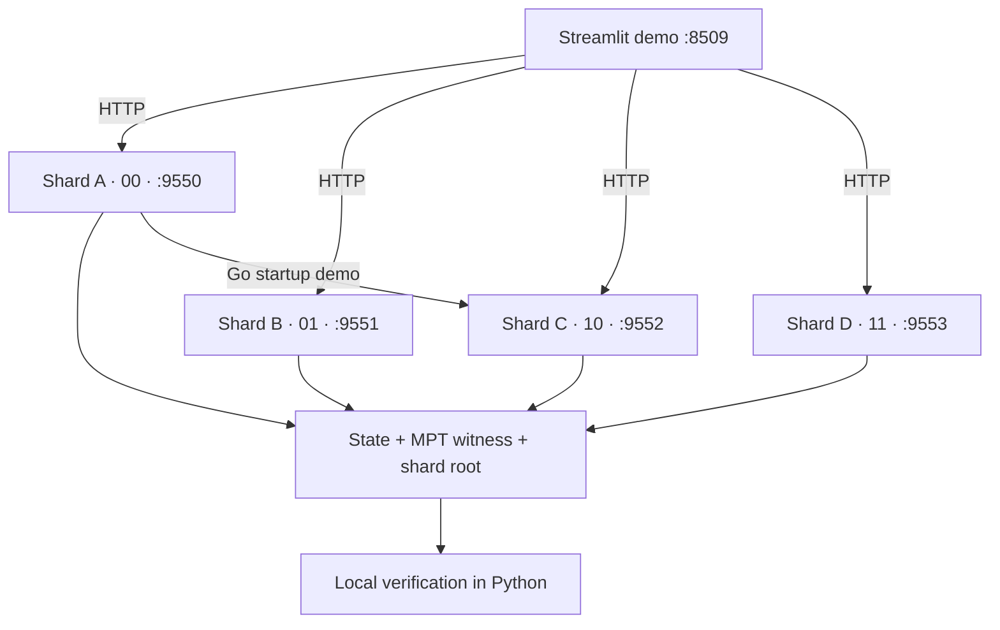

# Prefix-Based Distributed Ethereum State Sharing

**In one sentence:** a research prototype that assigns state ownership by hash prefix and retrieves remote values with locally verifiable Merkle Patricia Trie proofs.

Ethereum execution depends on account and contract state. Replicating a large world-state database across participating nodes creates storage, synchronization and I/O costs. This project explores assigning each node a deterministic portion of the key space and obtaining other required values from peers.

The proof of concept uses four Dockerized Go services built from this modified go-ethereum tree. A requester derives the owner from the address, retrieves state and an MPT witness over HTTP, and verifies the witness locally against a supplied shard root. A Streamlit interface makes ownership, retrieval, proof inspection and tampering visible.

The current result demonstrates distributed retrieval and proof mechanics. It is a **proof of concept / research prototype**, with simplified state and separate execution research models; it is not production-ready distributed Ethereum state infrastructure.

## Documentation

| Guide | Purpose |
| --- | --- |
| [Project Design & Concepts](docs/PROJECT.md) | Problem, theory, architecture, trust model and research direction |
| [Implementation & Demo](docs/IMPLEMENTATION_AND_DEMO.md) | Actual Go/Python behavior, API, validation and demonstration sequence |
| [Installation & Setup](docs/SETUP.md) | Requirements, commands, running, tests and troubleshooting |
| [Original go-ethereum README](docs/README.geth-upstream.md) | Preserved upstream background, build instructions and attribution |

## Problem and proposed solution

Storing the complete world state on every participating node can be expensive. Partitioning ownership can lower the fraction of keys assigned to one node, while increasing its dependence on remote state availability. Proofs are needed because a remote payload cannot simply be trusted.

Ownership uses **SHA-256 of the raw 20-byte address**, followed by its leading `p` bits. The live prototype uses **p = 2**:

| Prefix | Owner | Host endpoint |
| --- | --- | --- |
| 00 | Shard A / Node 0 | `http://localhost:9550` |
| 01 | Shard B / Node 1 | `http://localhost:9551` |
| 10 | Shard C / Node 2 | `http://localhost:9552` |
| 11 | Shard D / Node 3 | `http://localhost:9553` |

One prefix at p=2 corresponds to **25% expected logical key-space coverage** and a **75% modelled reduction** under uniform assignment. This is not a measured disk reduction. Each live node currently holds one seeded demo value.

## Architecture



Each service listens on container port 8551. The dashboard contacts the owner directly; the Go node0 startup demo independently retrieves and verifies state from node2. The network uses static HTTP peers.

## Implemented features

- Deterministic prefix ownership and owner routing.
- Four independent Dockerized Go shard services.
- `GET /root` and `GET /state/{address}`.
- Real MPT generation, proof transport and local verification in Go/Python.
- Proof inspection and local witness-corruption demonstration.
- Streamlit interface for topology, lookup and clearly labelled research models.

## Capability status

| Status | Scope |
| --- | --- |
| **LIVE** | Go ownership/storage, four HTTP services, root/state retrieval, MPT generation and verification; Python inspects real responses and reruns verification/tampering locally |
| **MODELLED** | Block workload, frontend LFU cache behavior, prefetch/fallback timing, proof-dictionary comparisons and logical scaling beyond four shards |
| **PLANNED** | Complete runtime/EVM integration, independently authenticated canonical shard roots, batch endpoints and live execution/cache telemetry |

The current dashboard claim check has a base64/text representation mismatch: an honest response can pass root and MPT checks but fail overall acceptance. The [implementation guide](docs/IMPLEMENTATION_AND_DEMO.md#verification-and-the-current-value-mismatch) explains the distinction and other verifier gaps.

## Quick start

Requires Docker with Compose v2 and Python with pip/venv. See [SETUP.md](docs/SETUP.md) for prerequisites, branch handling and troubleshooting.

```bash
git clone --branch state-sharing https://github.com/Kasreply/go-ethereum.git
cd go-ethereum
docker compose up -d --build
docker compose ps
```

In a second terminal, from the same repository root:

```bash
cd state-sharing-dashboard
python3 -m venv .venv
source .venv/bin/activate
python -m pip install -r requirements.txt
python -m streamlit run app.py --server.port 8509
```

Open **http://localhost:8509**. Use requester Shard A and account `0x0000000000000000000000000000000000000004` to retrieve the seeded value from Shard C.

These reorganized dashboard/doc files are pending review and remain uncommitted. A remote clone needs the corresponding files to be published before this exact setup is available there.

## Repository structure

```text
README.md
 docs/
 ├── PROJECT.md
 ├── IMPLEMENTATION_AND_DEMO.md
 ├── SETUP.md
 └── README.geth-upstream.md
 state-sharing/                 # Ownership, store, HTTP, proofs and experiments
 cmd/state-sharing-node/       # Four-process HTTP demo binary
 cmd/state-sharing-demo/       # Separate in-process routing experiment
 core/state/statedb.go         # Partial remote-account fetch hook
 state-sharing-dashboard/
 ├── app.py                    # Canonical demonstration entry point
 ├── requirements.txt
 ├── .streamlit/config.toml
 ├── backend_contract_v4.json   # Draft future API contract
 └── archive/                  # Preserved earlier dashboard versions and notes
 docker-compose.yml
 Dockerfile.state-sharing-node
```

Existing upstream geth directories and historical docs remain in place.

## Key limitations and project status

The four-node demo uses in-memory opaque strings and HTTP peers. StateDB has a mock-tested remote-account hook, but normal geth startup does not wire it to these services, and no transparent distributed EVM execution is demonstrated. Shard roots are obtained from the owners themselves; independent canonical/global authentication remains future work.

UI execution and performance results are models, not measured block benchmarks. The project establishes retrieval and proof mechanics while documenting the correctness and integration work still needed. See [Implementation & Demo](docs/IMPLEMENTATION_AND_DEMO.md) for exact behavior and the recommended presentation sequence.

Upstream library code is covered by [COPYING.LESSER](COPYING.LESSER), and command code by [COPYING](COPYING). The original upstream README is preserved unchanged in [docs](docs/README.geth-upstream.md).
