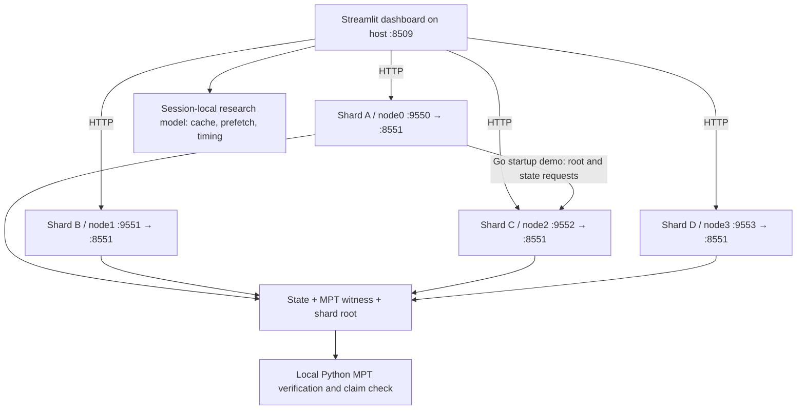
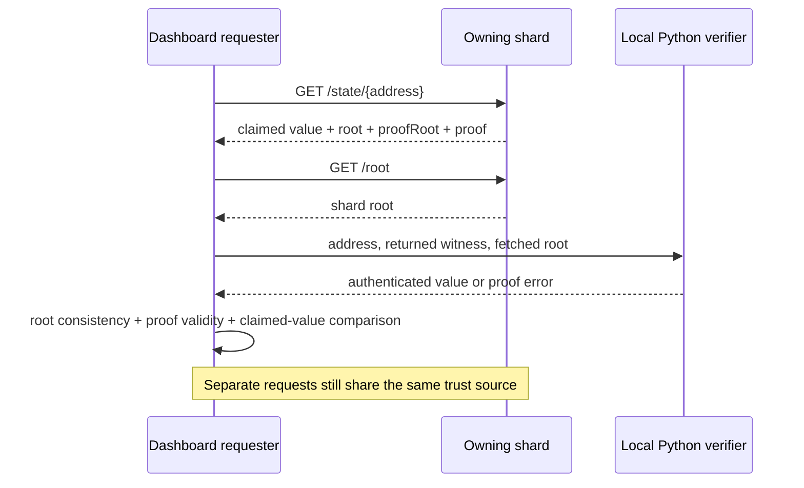

# Implementation and Demo

[Repository](../README.md) · [Project design](PROJECT.md) · [Implementation and demo](IMPLEMENTATION_AND_DEMO.md) · [Setup](SETUP.md)

## Implementation overview

The working PoC consists of four independent Go HTTP processes, in-memory owned state, real geth MPT witnesses and a Python verifier/explorer. This document describes the code as it exists, including differences between intended acceptance and actual behavior. It does not imply full distributed EVM execution.

## Repository map

| Path | Purpose |
| --- | --- |
| [cmd/state-sharing-node/main.go](../cmd/state-sharing-node/main.go) | HTTP node flags, deterministic seed and cross-process startup demo |
| [cmd/state-sharing-demo/main.go](../cmd/state-sharing-demo/main.go) | Separate three-validator, in-process routing demonstration; uses the response root as its verification anchor |
| [state-sharing/ownership.go](../state-sharing/ownership.go) | SHA-256 prefix extraction and demo address search |
| [state-sharing/store.go](../state-sharing/store.go) | Owned map, trie reconstruction, local/remote reads and proof generation |
| [state-sharing/proof.go](../state-sharing/proof.go) | Root checks and geth proof verifier |
| [state-sharing/server.go](../state-sharing/server.go), [client.go](../state-sharing/client.go), [transport.go](../state-sharing/transport.go) | HTTP handlers, client, JSON/proof encoding |
| [state-sharing/peer_router.go](../state-sharing/peer_router.go) | Static owner-to-peer dispatch used by HTTP demo |
| [state-sharing/routing.go](../state-sharing/routing.go) | In-process Kademlia-style buckets and iterative search |
| [state-sharing/block_lifecycle.go](../state-sharing/block_lifecycle.go) | Experimental LFU, abstract transactions, proposal/receive/update paths |
| `state-sharing/*_test.go` | Ownership, proofs, transport, HTTP, routing, lifecycle tests and synthetic microbenchmark |
| [core/state/statedb.go](../core/state/statedb.go), [statedb_test.go](../core/state/statedb_test.go) | Partial account fetch interception and mock test |
| [docker-compose.yml](../docker-compose.yml) | Four p=2 nodes and host ports |
| [Dockerfile.state-sharing-node](../Dockerfile.state-sharing-node) | Go 1.22 builder, `CGO_ENABLED=0`, distroless runtime |
| [state-sharing-dashboard/app.py](../state-sharing-dashboard/app.py) | Canonical polished demo entry point |
| `state-sharing-dashboard/archive/` | Preserved historical dashboard versions and notes |
| `state-sharing-dashboard/.streamlit/config.toml` | Project-local dark theme |
| [state-sharing-dashboard/requirements.txt](../state-sharing-dashboard/requirements.txt) | Explicit Python dependencies for the canonical app |
| [state-sharing-dashboard/backend_contract_v4.json](../state-sharing-dashboard/backend_contract_v4.json) | Draft future API schemas, not implemented handlers |
| `cmd/`, `core/`, `trie/`, `triedb/`, `eth/`, `p2p/`, `tests/` | Upstream geth commands, execution, trie, networking and test infrastructure |
| [docs/README.geth-upstream.md](../docs/README.geth-upstream.md) | Preserved original geth README, including build, RPC and private-network background |

## Architecture and implementation



The four services run the custom `state-sharing-node` binary, built from this geth source tree. They are independent processes with in-memory `StateStore` maps, static prefix-to-peer routing and HTTP transport. Compose uses a bridge network named `state-sharing` in its configuration. It does not start a consensus client, mainnet synchronization, devp2p state exchange, or a full geth execution node.

`StateStore.Put` rejects keys outside the node's ownership. Local `GetState` reads the map. Remote `GetState` delegates through `PeerRouter` to an `HTTPPeer`, then verifies the returned proof. The HTTP server itself serves only owned state: sending a foreign account to `/state/` returns 404 rather than forwarding it.

There are two distinct live request paths:

- **Go startup demonstration:** `node0` waits three seconds, fetches node2's root, then retrieves Account 0004 through `StateStore.GetState`. Compose permits 15 attempts while peers become ready. A successful log ends with `DEMO PASSED` and the authenticated value.
- **Dashboard lookup:** Python represents a selected requester and directly contacts the owner. The visual A → C arrow does not mean the browser asked node0 to proxy the request. Python retrieves state first and root second, then verifies locally.

The repository also contains an in-process Kademlia-style routing experiment and abstract block lifecycle with an LFU cache. Those are library experiments, separate from the static HTTP network and from the frontend simulator.

### Partial StateDB integration

[core/state/statedb.go](../core/state/statedb.go) defines `StateFetcher` and `SetStateFetcher`. If the local account reader returns no account, `getStateObject` can call a configured fetcher with the address and `originalRoot`, then RLP-decode the result into `types.StateAccount`. A mock-backed test exercises nonce and balance reads.

Repository-wide inspection found the setter called only in that test. Normal geth startup does not configure the HTTP fetcher. The demo's opaque strings are not RLP account objects; its shard root is not automatically the canonical world-state root expected by StateDB. Storage-slot/code retrieval, root authentication and full execution wiring still require work. Thus an interception hook exists, but transparent distributed EVM execution is not delivered by this demo.

## Four-node mapping and ownership implementation

| Shard | Service | Prefix | Host → container port | Seed suffix |
| --- | --- | --- | --- | --- |
| A | `node0` | 00 | 9550 → 8551 | 0002 |
| B | `node1` | 01 | 9551 → 8551 | 0006 |
| C | `node2` | 10 | 9552 → 8551 | 0004 |
| D | `node3` | 11 | 9553 → 8551 | 0000 |

`PrefixOf` in [ownership.go](../state-sharing/ownership.go) hashes raw key bytes with SHA-256 and extracts the first p bits, most significant bit first. `BelongsToAddress` uses the 20 address bytes; `StateStore.Put` enforces that ownership. `FindAddressWithPrefix` searches candidate last bytes 0–254 and picks the first matching address.

Each address above is zero-padded to 20 bytes. Each node seeds `hello from node prefix N`. The HTTP server does not populate other addresses automatically.

## Complete Account 0004 lookup

```text
0x0000000000000000000000000000000000000004
→ SHA-256(raw address bytes)
→ leading bits 10
→ prefix 2 / Shard C
→ requester A is remote
→ Python GET http://localhost:9552/state/{full address}
→ claimed value + MPT witness + root fields
→ Python GET http://localhost:9552/root
→ local proof verification obtains hello from node prefix 2
→ compare claimed value
→ current dashboard rejects overall acceptance due to base64/text mismatch
```

The Go startup demonstration obtains the root first, then reads through `StateStore.GetState`, `PeerRouter` and `HTTPPeer`. It returns the proof-derived bytes and can report `DEMO PASSED`. The dashboard's local-owner branch only displays ownership and makes no state request.

## State retrieval and MPT verification

A **trie** indexes keys by their paths. A **Merkle Patricia Trie (MPT)** combines path compression with cryptographic commitments to child nodes. Its **state root** acts as a fingerprint of the contents: changing authenticated data changes the commitment under the hash function's security assumptions.

An **MPT proof**, also called a **witness**, supplies the encoded nodes required to authenticate a key under a given root. A **proof node** is one of those trie nodes. **RLP**, Recursive Length Prefix, serializes the nested byte strings/lists that represent the nodes. The **claimed value** is the separately transmitted payload; the **proof-derived value** is the value recovered by traversing the authenticated witness.

These demo roots commit to each shard's local map. They are not roots of the complete Ethereum world state. The demo inserts **raw address bytes** into a plain geth trie; it does not use the secure account trie key transformation of normal Ethereum account storage.

### Owner-side proof construction

`StateStore.Root` and `GetStateProof` each rebuild a temporary in-memory trie from all locally stored entries using `tr.Update(address.Bytes(), state)`. `tr.Hash()` computes its root; `tr.Prove(key.Bytes(), proofDB)` produces the witness. No persistent trie or historical root service is maintained. With the default one-key seed, the returned witness is a single leaf node.

[transport.go](../state-sharing/transport.go) serializes proof-database entries as `key`/`value` pairs. Go JSON encodes byte slices as **base64 strings**, while `common.Hash` roots are `0x`-prefixed hexadecimal. The client reconstructs a proof database from these entries.



### Verification and the current value mismatch

The intended acceptance rule is: require consistent roots, a valid witness under the expected root, and byte-for-byte agreement between the decoded claim and the proof-derived value. Actual behavior differs by verifier:

| Check | Go `VerifyRemoteState` / `GetState` | canonical dashboard dashboard |
| --- | --- | --- |
| Response root equals caller/fetched root | Required | Required |
| `proofRoot` equals response root | Required | Not checked |
| MPT proof verifies for requested key | `trie.VerifyProof` | Base64 decode → RLP decode → `HexaryTrie.get_from_proof` |
| Compare claimed value with authenticated value | No explicit comparison; returns the proof-derived bytes and ignores the claim | Comparison is required, but does not base64-decode the wire claim |
| Missing value | `GetState` rejects a nil proof result | Helper treats a non-throwing proof call as success; no separate membership/nonempty check |
| Overall acceptance | Authenticated result returned if required checks pass | `root_match and proof_ok and claim_match` |

For the default Shard C response:

```text
wire.value:       aGVsbG8gZnJvbSBub2RlIHByZWZpeCAy
proof-derived:    hello from node prefix 2
root_match:       true
proof_ok:         true
claim_match:      false (current dashboard implementation)
accepted:         false
```

The dashboard compares the base64 string directly with decoded text or raw bytes. This explains why a valid witness can accompany a rejected state response. The correct future comparison is `base64.b64decode(wire["value"]) == proof_value`, with malformed/missing fields rejected and all root fields checked. The current code also treats an absent claim as matching. This guide documents these gaps; it does not silently change the verifier.

Python derives trie node identities from the decoded witness and does not validate the wire `key` fields separately. Go uses those keys to reconstruct its proof database. Neither UI display fingerprints nor shortened roots substitute for MPT verification. Proof absence and proof membership also need to be distinguished before claiming that an account exists.

## Attack cases and root trust

| Attack | Demonstration | What it establishes |
| --- | --- | --- |
| Change the claimed value | Attack Lab compares user-entered text (default `500 ETH`) with the stored proof-derived text | A different claim cannot be justified by the unchanged witness. This is a local comparison demonstration, not a modified HTTP server response. |
| Corrupt proof bytes | Copy the real witness, XOR the last byte of its first node with `0xFF`, then rerun Python verification | The default one-leaf witness no longer verifies against the original root. Rejection may occur at decoding or trie verification. |
| Fabricate state, proof and root together | Attack Lab explains the trust boundary; it does not build a malicious shard | An internally valid fabricated trie passes a consistency check if the verifier also trusts its fabricated root. |

The Go path uses authenticated bytes rather than the unchecked `RemoteState.Value`, so changing only the claim does not change the value returned to the caller. It does not explicitly report that claim as malicious. The dashboard's normal lookup encoding defect is separate from the Attack Lab's text comparison.

Fetching `/root` separately does **not** make the root independently trusted when the same shard controls both endpoints. The Go verification API can reject a forged root if the caller supplies a truly independent expected root; the unit suite includes that case. The running demo instead uses the owner's root as a stand-in.

The planned security chain is:

```text
account value → MPT membership proof → shard root
             → shard-root commitment proof → independently trusted canonical/global root
```

The global commitment must itself be authenticated, for example through an agreed canonical block-state mechanism. Merely adding another endpoint under the same malicious operator would not establish this trust.

## HTTP API

These are custom state-sharing HTTP endpoints, not Ethereum JSON-RPC. Successful responses use `Content-Type: application/json`. The current server registers only two routes and accepts GET for both; other methods receive 405.

### GET /root

```bash
curl -sS http://localhost:9552/root
```

Default Shard C root (also returned in the live state response inspected for this guide):

```json
{"root":"0xbab2632cdb154f8f846b2cb49399b682f80f001915fbef999c11126282773bb1"}
```

This root depends on the local dataset; changing the seed changes it. Internal root-generation failure returns 500. There is no block number, signature, root history or commitment proof in this response.

### GET /state/{address}

```bash
curl -sS http://localhost:9552/state/0x0000000000000000000000000000000000000004
```

Actual default-seed response:

```json
{
  "value": "aGVsbG8gZnJvbSBub2RlIHByZWZpeCAy",
  "root": "0xbab2632cdb154f8f846b2cb49399b682f80f001915fbef999c11126282773bb1",
  "proofRoot": "0xbab2632cdb154f8f846b2cb49399b682f80f001915fbef999c11126282773bb1",
  "proof": [
    {
      "key": "urJjLNsVT4+Eayy0k5m2gvgPABkV+++ZnBESYoJ3O7E=",
      "value": "75UgAAAAAAAAAAAAAAAAAAAAAAAAAASYaGVsbG8gZnJvbSBub2RlIHByZWZpeCAy"
    }
  ]
}
```

| Field | Meaning / encoding |
| --- | --- |
| `value` | Claimed opaque state bytes, base64; decodes to `hello from node prefix 2` |
| `root` | Shard trie root, 32-byte hex hash |
| `proofRoot` | Root attached to the proof, 32-byte hex hash |
| `proof[].key` | Proof database key, base64 bytes |
| `proof[].value` | RLP-encoded proof node, base64 bytes |

Use exactly 40 hexadecimal address characters, conventionally prefixed with `0x`. Go's address validator also accepts the full address without that prefix. The server validates address syntax, not human aliases such as “Account 0004.”

| Status | Meaning |
| --- | --- |
| 200 | Value and witness returned |
| 400 | Invalid/missing address (`invalid address`) |
| 404 | Unowned or owned-but-unseeded key (`not found`); both intentionally share this status |
| 405 | Method not allowed |
| 500 | Internal generation/serialization error |

## Docker implementation

[Dockerfile.state-sharing-node](../Dockerfile.state-sharing-node) builds `./cmd/state-sharing-node` in a Go 1.22 image with `CGO_ENABLED=0`, then copies the binary into `gcr.io/distroless/static-debian12`. The runtime exposes port 8551. [Compose](../docker-compose.yml) creates four services on a bridge network with distinct prefixes and static service-name peers.

No persistence volume, consensus client or native geth execution process is started by this Compose file. `node0` waits three seconds before its request and is configured for 15 attempts while peers become ready. Node state is reconstructed from the seed on restart.

## Streamlit demonstration interface

The canonical [app.py](../state-sharing-dashboard/app.py) is the polished V6 fixed dashboard that was running on port 8509 before consolidation. Only its launch docstring changed during promotion; its application behavior and custom CSS were preserved. Project-local `.streamlit/config.toml` sets the native widget theme to dark. The former entry point, older versions and version-specific notes/requirements are preserved in `archive/`; archived instructions are historical, not the supported setup path.

The interface provides node reachability, topology, ownership derivation, remote lookup, local proof verification, witness/RLP inspection, local tampering demonstrations and labelled research models. It directly calls the owner from Python; selecting requester A does not cause node0 to proxy dashboard traffic. Use [SETUP.md](SETUP.md) for the canonical launch command.

The displayed node fingerprints are UI-only SHA-256 identifiers; MPT verification uses decoded witnesses and full trie roots. Witness entries are displayed in transport order, not reconstructed traversal order. Proof Explorer and Attack Lab use the latest remote result even when overall acceptance is false. A Research Lab source branch exists but is absent from the current sidebar navigation.

## Live, modelled, and planned capabilities

**LIVE** means actual local computation or HTTP/proof activity in this PoC. **MODELLED** means a synthetic frontend calculation, even when a widget says “benchmark.” **PLANNED** means not exposed by the running protocol. Experimental Go library code is identified separately.

| Capability | Status | Scope / evidence |
| --- | --- | --- |
| SHA-256 ownership and p=2 mapping | LIVE | Go helper and Python equivalent |
| Four Docker services and port mappings | LIVE | Compose; dashboard probes HTTP availability |
| `/root`, `/state/{address}` | LIVE | Two handlers in `server.go` |
| Remote retrieval and returned shard root | LIVE | Go startup demo and Python HTTP requests |
| MPT generation, transport and verification | LIVE | geth trie and Python `HexaryTrie` |
| Claimed-value check | LIVE, claim check defective | Base64/text mismatch described above |
| Proof inspection and corruption test | LIVE | Real returned witness, modified locally |
| HTTP latency and proof-check duration | LIVE client measurements | Localhost timings, not execution throughput |
| Required block keys, cache hits/misses, prefetch and fallback | MODELLED | Python session-local workload |
| Proof Dictionary bytes and comparative timings | MODELLED | Synthetic identifiers and fixed cost formulas |
| Physical scaling for p > 2 | PLANNED; visualization MODELLED | Four services remain running |
| LFU and abstract block lifecycle in Go | Experimental library code | In-process peers and supplied state updates; no EVM |
| StateDB remote account hook | Experimental, mock-tested | Not configured by production startup |
| Live cache telemetry and instrumented block execution | PLANNED | Draft backend contract only |
| Batch state/proof retrieval | PLANNED | No active batch handler |
| Canonical root / shard-root authentication | PLANNED | Owner roots remain unauthenticated |
| Structured account values, state transitions, historical roots | PLANNED for HTTP demo | Seeded strings and current local roots only |

## Limitations and next interfaces

The PoC is a simplified HTTP network with fixed peers, one seeded opaque value per node, no persistence, and roots rebuilt per request. It has no state-sharing devp2p transport, canonical shard-root authentication, protocol state updates, historical versions or physical reconfiguration from UI sliders. It is not production-ready.

The partial StateDB hook currently handles only a missing account through an explicitly configured fetcher. Completing it requires structured RLP account data, correct key/root semantics, storage/code access handling and runtime wiring. The normal reader's errors are handled before the hook, and failed fetch/decode attempts fall through as absent accounts; robust execution behavior still needs design. `StateDB.Copy` also does not currently copy the fetcher field.

The experimental Go lifecycle applies caller-supplied update maps rather than executing Ethereum transactions. Its LFU is address-keyed without root/version tracking, and is not the dashboard's three-tier cache. Real value-cache reuse requires freshness rules, and witness caches must remain tied to the root they prove.

[backend_contract_v4.json](../state-sharing-dashboard/backend_contract_v4.json) is a draft, not a server implementation. Proposed work includes:

| Future interface / capability | Why it is useful |
| --- | --- |
| `GET /status` | Node identity, ownership, roots and actual request/runtime counters |
| `GET /cache/stats` | Live per-tier hits, misses, entries, byte counts and evictions |
| `POST /block/execute` or equivalent execution hook | Instrument real state resolution, fallback, EVM CPU and commit timing |
| `POST /state/batch` | Fetch multiple owner-local keys with a shared root-bound witness |
| Canonical/global commitment endpoint or block-state object (path undecided) | Supply an independently authenticated commitment to shard roots |
| Shard-root commitment proof (interface undecided) | Prove an owner root belongs under that canonical commitment |
| Structured account response | Expose nonce, balance, storage root and code hash instead of demo text |
| State-transition endpoint (path undecided) | Exercise authenticated before/after state and root changes |
| Batch proof capability (potentially part of `/state/batch`) | Deduplicate shared witness nodes and measure actual byte savings |
| Optional state-history endpoint (path undecided) | Query prior versions and test root-scoped replay |

A useful evaluation would measure storage bytes, remote calls, fetched state/proof bytes, cache reuse, prefetch coverage, dynamic misses, proof CPU, EVM CPU and total block latency under documented workloads and network conditions. It should compare cold and warm caches and distinguish actual delays from injected RTT. Those measurements are future work, not results claimed here.

## Known implementation gaps

- The dashboard compares base64 claim text with authenticated plaintext/bytes, ignores `proofRoot`, treats an absent claim as matching, and does not separately distinguish membership from a non-throwing absence proof. Go uses proof-derived bytes but does not explicitly reject a mismatched claim.
- Canonical root trust and normal StateDB/HTTP execution wiring are incomplete. Demo strings cannot serve directly as RLP account objects.
- The model folds logical prefixes onto four physical owners, so p>2 counts do not implement the theoretical per-owner fraction. A p=0 comparison should use requester A.
- Performance comparisons start with cold caches, suppress fallback in prefetch rows and use synthetic witness byte accounting. They do not establish measured LFU or EVM gains. Cache reset retains last-block counters until another model run.
- The original dashboard documents refer to historical entry points; they are now archived. Dashboard/docs files are still untracked until explicitly staged and committed by the maintainer after review.

## Testing and validation

The following checks were performed during the documentation and entry-point reorganization on 2026-09-10. Setup also provides reproducible test and curl commands. Tests of in-process lifecycle/routing and mock-backed StateDB interception do not prove full HTTP-backed EVM execution.

| Validation | Result |
| --- | --- |
| `git diff --check` | Passed |
| `docker compose config` | Passed; four services and 9550–9553 → 8551 mappings confirmed |
| `python3 -m py_compile state-sharing-dashboard/app.py` | Passed |
| `go test ./state-sharing/...` | Passed |
| `go test ./core/state -run '^TestRemoteStateDBInterception$' -count=1` | Passed |
| `docker compose ps` | Four running services with expected ports |
| Direct `curl -fsS` to all four `/root` endpoints and node2's `/state/0x0000000000000000000000000000000000000004` | All returned expected JSON; state response matches the example above |
| Existing dashboard environment: `python -m pip check` | No broken requirements |
| Streamlit `AppTest` smoke check | All nine sidebar pages rendered without exceptions; lookup reproduced valid proof plus claim mismatch; Proof Explorer and corruption rejection passed |
| Document links/anchors, archive hashes and canonical Python AST comparison | Passed; archives/upstream copy unchanged and application code unchanged apart from the module launch docstring |

The Streamlit smoke check used mocked HTTP responses containing the captured live Shard C fixture; it was not a browser or end-to-end network UI test. Live HTTP was checked separately with curl. Go tests and Docker/socket checks initially hit sandbox restrictions and passed when rerun with the required access. A fresh dependency installation, clean-clone rebuild and browser visual walkthrough were not performed. Existing versioned Streamlit processes were not restarted; follow the canonical restart instructions in Setup.

## Demo sequence

1. Start Docker using the [setup guide](SETUP.md) and confirm all four services.
2. Curl all four roots and show node0's `DEMO PASSED` log if available.
3. Start the canonical Streamlit app and show reachable nodes/topology.
4. Select requester A and resolve Account 0004; explain prefix 10 and owner C.
5. Retrieve the state and inspect root consistency, MPT validity and claimed-value comparison separately.
6. Explain the current base64 mismatch rather than presenting overall acceptance as successful.
7. Inspect the real MPT witness and proof-derived state.
8. Corrupt the witness and show rejection; compare a false claim with the proof-backed value.
9. Explain the same-owner root-trust limitation.
10. Show research extensions, explicitly labelling cache, block and performance figures as modelled.
