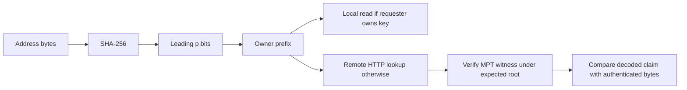

# Project Design and Concepts

[Repository](../README.md) · [Project design](PROJECT.md) · [Implementation and demo](IMPLEMENTATION_AND_DEMO.md) · [Setup](SETUP.md)

## Introduction

This project studies prefix-based distributed ownership of Ethereum-like state. It asks how a node can retain a smaller portion of the key space while obtaining verifiable remote data when needed. The current implementation establishes the retrieval and proof mechanics; research models explore possible execution optimizations.

## Problem statement and motivation

Ethereum's world state describes accounts and their current data, including balances, nonces, contract storage and references to code. Execution needs the relevant state to decide what a transaction does. Retaining and accessing a large state database costs storage capacity, disk I/O, synchronization work and operational resources. State is distinct from the full history of blocks and transactions.

The research idea is to partition responsibility for state keys. A node retains its assigned partition and obtains other required values from peers. This can reduce local key-space coverage, at the cost of network dependence: an unavailable or slow owner can delay execution, and a dishonest owner can return false information. Cryptographic proofs let a requester authenticate a value against an expected root without storing the complete trie.

The demo uses small in-memory datasets rather than an Ethereum mainnet snapshot. Its storage percentages are expectations over uniformly distributed ownership hashes, not measured disk savings. Trie overhead, unequal value sizes, replication, cache space and real workload skew would affect a deployed system.

## Proposed solution

Assign each state key to an owner using leading bits of a deterministic hash. A requester computes that assignment locally, reads owned state locally when available, and requests remote state with a proof from the appropriate owner. Cryptographic verification authenticates the result under an expected root.

Ownership partitioning reduces the expected fraction of keys assigned to one logical owner. It also creates dependencies on other owners' availability and response times. This prototype studies that trade-off without claiming measured disk savings or execution speedups.

## Ethereum world state

| Concept | Meaning |
| --- | --- |
| Ethereum state | Current data needed to evaluate transactions |
| Account state | Nonce, balance, storage root and code hash for an account |
| World state | The full collection of account states, distinct from block history |
| State key | Identifier used to retrieve state; the live demo uses 20-byte addresses |
| State trie | A trie committing to a collection of state entries |

The demo values are opaque strings, not complete Ethereum account objects. Its per-shard tries illustrate authenticated storage, rather than representing a synchronized mainnet world state.

## Prefix ownership

[ownership.go](../state-sharing/ownership.go) computes **SHA-256 of the raw 20 address bytes**, then extracts the leading `p` bits, most significant bit first. It does not hash the printable `0x…` string. The hash used to assign ownership is separate from the Keccak-based hashing used inside Ethereum's MPT.

```text
Number of logical prefixes = 2^p
Expected local key-space coverage = 1 / 2^p
Modelled storage saved = 1 - 1 / 2^p
```

These formulas assume one logical prefix per node. They do not mean that four physical machines can each store `1/64` of all keys while collectively covering the entire key space without additional assignments.

| Prefix depth p | Logical prefixes | Expected local coverage | Modelled storage saved |
| --- | ---: | ---: | ---: |
| 0 | 1 | 100% | 0% |
| 1 | 2 | 50% | 50% |
| 2 | 4 | 25% | 75% |
| 3 | 8 | 12.5% | 87.5% |
| 4 | 16 | 6.25% | 93.75% |
| 5 | 32 | 3.125% | 96.875% |
| 6 | 64 | 1.5625% | 98.4375% |

The live Compose network is fixed at **p = 2**:

| Prefix | Shard | Node / Compose service | Host endpoint | Container port | Seeded address suffix |
| --- | --- | --- | --- | ---: | --- |
| 00 | A / Alpha | Node 0 / `node0` | `http://localhost:9550` | 8551 | `0002` |
| 01 | B / Beta | Node 1 / `node1` | `http://localhost:9551` | 8551 | `0006` |
| 10 | C / Gamma | Node 2 / `node2` | `http://localhost:9552` | 8551 | `0004` |
| 11 | D / Delta | Node 3 / `node3` | `http://localhost:9553` | 8551 | `0000` |

Each seed address is zero-padded to 20 bytes. `FindAddressWithPrefix` searches last-byte values 0 through 254 and selects the first match. Each process stores **one** seeded value, `hello from node prefix N`; it does not populate every account in its assigned partition.

### Finding the owner

1. Select an account, such as `0x0000000000000000000000000000000000000004`.
2. Decode its hexadecimal representation into 20 bytes.
3. Compute SHA-256 and read its first `p` bits.
4. Interpret those bits as a prefix number and consult the peer map.
5. Compare the owner with the requester to classify the access as local or cross-shard.

```text
Account 0004
→ SHA-256(raw 20-byte address)
→ leading bits = 10
→ prefix number 2
→ Shard C / node2 / localhost:9552
```

The **home shard** is the owner of the account. The **requester** is the node whose need for state is being represented. A **cross-shard** access has different requester and owner prefixes. With requester A, Account 0004 is remote; with requester C, it is local. Friendly account names are display aliases only.

The Go ownership helper supports up to 64 bits; `p=0` means all keys belong locally. This is not evidence of a tested 64-bit deployment: the demo seed search is bounded and Compose has only four services. Dashboard sliders change research calculations, not Go flags. The execution model folds logical prefixes onto four owners with `prefix % 4`; above `p=2`, its physical owner counts therefore do not implement the theoretical `2^-p` storage fraction.

## Local and remote state

Local state is assigned to the current requester; remote state is assigned to another shard. Assignment does not imply existence: the demo seeds one account per node. A local read can miss, and a remote owner can report that a key is absent.

The requester needs communication for remote state because it does not hold the owner's full dataset. It must distinguish proof validity from peer availability and from whether the root is independently trustworthy.

## State retrieval architecture



The dashboard represents a requester but sends its own HTTP requests directly to the owner. The Go node0 startup demonstration separately performs a real node-to-node retrieval. Neither path uses state-sharing devp2p transport.

## Merkle Patricia Tries and witnesses

A trie follows a key's path through a tree-like index. A Merkle Patricia Trie combines compressed paths with cryptographic references to trie nodes. Its root is a commitment to the contents: altering authenticated data changes the corresponding root under the hash function's security assumptions.

| Term | Meaning for verification |
| --- | --- |
| State root | Cryptographic fingerprint of the trie contents |
| MPT proof / witness | Nodes sufficient to authenticate a key's value or absence under a root |
| Proof node | One encoded trie node in the witness |
| Proof-derived value | Bytes recovered through authenticated trie traversal |
| Claimed value | Separate payload supplied by the owner |
| RLP | Recursive Length Prefix encoding of nested byte strings and lists |

The ownership hash is SHA-256, while MPT node commitments use the trie's Keccak-based hashing. The demo inserts raw address keys into a plain geth trie; normal Ethereum account storage uses different secure-key semantics. A demo shard root must not be described as the canonical Ethereum world-state root.

## Verification model

```text
owner returns claimed state + MPT proof
→ requester obtains expected root
→ requester verifies witness locally for the requested key
→ requester obtains proof-backed bytes
→ compare decoded claim with proof-backed bytes
→ accept or reject
```

The intended model requires root consistency, proof validity, and consistent claimed bytes. Verifying a witness avoids trusting the remote payload on its own. It does not establish that the supplied root is canonical.

Actual implementation details matter: Go returns proof-derived bytes without explicitly comparing the claim. Python requires a claim match but currently compares its base64 representation with decoded text, rejecting an otherwise valid default response. The [implementation guide](IMPLEMENTATION_AND_DEMO.md#verification-and-the-current-value-mismatch) documents this discrepancy rather than assuming the intended acceptance rule is fully implemented.

## Security and trust model

Changing a claimed value without changing its witness cannot justify the new value under the original root. Corrupting required witness bytes breaks decoding or verification. These are useful tampering demonstrations, but they do not solve root trust.

A malicious owner can fabricate:

```text
fake state + internally valid proof + matching fake root
```

If the requester takes both the proof and root from that owner, internal consistency alone cannot identify the fabrication. Fetching the root in a separate HTTP request does not create a separate trust source. A future independently authenticated global commitment must bind the shard roots:

```text
state → membership proof → shard root
      → shard-root commitment proof → canonical/global commitment
```

The commitment itself needs an independent trust mechanism; another endpoint controlled by the same malicious peer would be insufficient.

## Storage versus network trade-off

Increasing p creates more logical regions and lowers expected key-space coverage for one logical owner. Under a workload that accesses keys across regions, this can increase remote dependencies. These are distribution assumptions, not measured storage or traffic results.

Caching can reuse remote values, provided their freshness is checked. Prefetching can fetch likely-required keys before execution needs them. Batching can group independent requests by owner and reduce sequential network waits. Proof deduplication can avoid transmitting shared trie nodes repeatedly. These are optimization directions; a correct execution path must still handle dynamically discovered misses through verified runtime fallback.

The dashboard models K(B), a block's required state-key set, and three cache domains: account headers, storage slots and bytecode. LFU means least-frequently-used eviction. A cache hit reuses a retained entry; a miss requires resolution and potentially insertion. Model hit rate is `hits / (hits + misses) × 100`, with zero displayed when there are no accesses. Populated entries can coexist with a cold-workload 0% hit rate because insertion is not reuse.

A useful evaluation would compare cold/warm workloads, actual storage bytes, fetched state/proof bytes, remote calls, fallback misses, proof CPU, EVM CPU and total latency. Emulated RTT must be reported separately from measured client timings. No such full execution evaluation is claimed here.

## Current limitations

- The live topology contains four physical services at p=2, with static HTTP peers.
- The data consists of one seeded opaque string per node, held in memory.
- StateDB has a mock-tested account-fetch hook, but normal geth startup does not wire it to the HTTP demo.
- Block execution, advanced cache/prefetch outcomes and performance comparisons are frontend models.
- Shard roots have no canonical/global authentication.
- The dashboard's claim encoding check and other verifier details remain incomplete.

## Future work

Priorities are consistent claim encoding and root validation, independently authenticated shard roots, structured account data, and full runtime integration including storage/code misses. Once correctness is established, implement owner-batched state retrieval, root-bound witness reuse and instrumented cache/execution metrics. Historical versions and state transitions would enable freshness and replay experiments.

See the [implementation guide](IMPLEMENTATION_AND_DEMO.md#limitations-and-next-interfaces) for concrete proposed interfaces and their current status.

## Conclusion

The proof of concept demonstrates that a requester can obtain state authenticated under a supplied shard root without retaining the full owner's trie. Prefix ownership provides a simple deterministic assignment scheme. Establishing independent root trust and integrating real execution are the next steps before evaluating practical storage and performance benefits.
